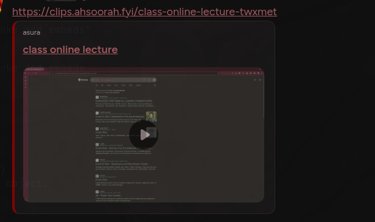
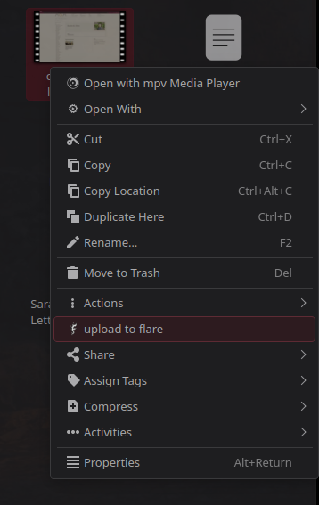
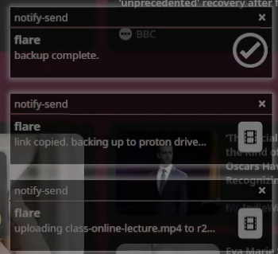
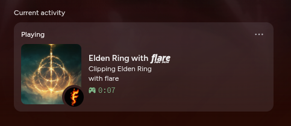

# flare

A personal clip-recording pipeline for Linux: record with [Vice](https://github.com/eklonofficial/Vice), right-click a clip in Dolphin, and a few seconds later it's on my own domain with a link that embeds in Discord, backed up to Proton Drive.

I built this for myself and I'm publishing it as a write-up, not a product. It's tuned to my machine and workflow (Fedora KDE, Wayland, an NVIDIA GPU).

**Example link:** https://clips.ahsoorah.fyi/(add later)



---

## The problem

I moved from Windows to Fedora Linux and lost my entire clipping workflow:

- **NVIDIA ShadowPlay** isn't available. The NVIDIA App has no Linux version, so the instant-replay buffer I'd relied on was gone.
- **Medal.tv** has no Linux client either (and in general, is quite bloated with social features).
- **Sharing was the real pain.** On Windows I could still clip a moment and send a link. On Linux the clips were files on disk, and most social applications like Discord's upload limit meant big ones couldn't just be dropped into a chat. I wanted unlimited-size clips shared by link, with a proper embed.

So I needed three things: a replay buffer with a hotkey, somewhere to put clips that has no size cap (so catbox and streamable were out), and a link that previews and embeds cleanly with a title in places like Discord.

## How I got there

**1. Finding Vice.** Vice is an open-source, Medal-style clip recorder for Linux, built on `gpu-screen-recorder`. It gave me the part I couldn't replace: an always-on replay buffer, a clip hotkey, game detection, video trimming, and a library UI.

**2. Making it fit my workflow.** Vice stops at "clip saved". Everything after that is mine:

- a native **Dolphin right-click action** that sends a clip through the pipeline,
- my **own secondary domain** (`clips.ahsoorah.fyi`) instead of a temporary tunnel or another website's URL,
- **Cloudflare R2** for storage, which has no egress fees,
- a **Cloudflare Worker** that turns a clean link into a Discord embed,
- and an automatic **Proton Drive** backup of every video (because I have a subscription for the full Proton ecosystem and use it daily).

**3. Rebranding without maintaining a fork.** My first approach was a full fork with my own commits on top of Vice's code. Every upstream update risked a merge conflict, so I changed the design: my tracking branch is now identical to upstream, and a script re-applies the visible rebrand after each update. More on that below.

**4. Giving back.** While customizing the Discord Rich Presence and application detection, I found improvements that belonged upstream, wrote them up, and sent them to the maintainer. Two were merged (see [Upstream contributions](#upstream-contributions)).

**5. A front end for the clips.** I built [manager.ahsoorah.fyi](https://manager.ahsoorah.fyi), a web interface to browse, rename and delete everything in the bucket. It is locked by a password and lives in its own repository, `flare-manager`, and talks to the Worker's API.

## How it works

```
 Vice (replay buffer)
        |  hotkey: save last N seconds
        v
 ~/Videos/flare/flare_clip_5.mp4
        |  right-click in Dolphin
        v
 flare-upload
   1. move the clip into a local archive, with a random 6-char hash
   2. upload it to a Cloudflare R2 bucket
   3. automatically copy https://clips.ahsoorah.fyi/<name> to the clipboard
   4. back the file up to Proton Drive
        |
        v
 Cloudflare Worker 
   extensionless link -> HTML page with Open Graph video tags -> Discord embed
   link with extension -> the raw video, streamed from R2 with range support
```



### The Dolphin action

`dolphin/flare-upload.desktop.in` is a KDE service menu. It adds a right-click entry that runs `bin/flare-upload` on the selected file. `Exec=` and `Icon=` in a `.desktop` file can't expand `$HOME`, so the repo stores a template and the installer fills in the real home directory.

### `bin/flare-upload`

A Bash script that does the whole pipeline. Settings (account ID, bucket, domain, archive folder, Proton path) are read from `~/.config/flare/config`, so no credentials or machine-specific values live in the repo. A few details:

- **It resolves symlinks first** (`readlink -f`), so it moves the real file, not a link to it.
- **The hash suffix** (`-wt6o08`) makes every link unique, so two clips with the same name can't collide, and a link can't be guessed.
- **Each step reports its own result.** It shows a desktop notification for the upload, the link copy and the Proton backup, and a failure shows up as an error notification and a line in the log, not as a silent success.
- In here, **Proton Drive is optional.** Leave `PROTON_DEST` empty to skip it.



### The Cloudflare Worker

`worker/index.js` is what makes a plain link behave like a real video page:

- **Extensionless URLs** (`/edit-wt6o08`): the Worker lists the bucket by prefix to find the real file, then returns a small HTML page with Open Graph and Twitter card video tags. That page is what Discord reads to build the embed. The title comes from the filename (or a custom title I set in the manager).
- **URLs with a video extension**: it streams the file straight from R2 and honors `Range` requests, so seeking and Discord's previews work on large files.
- **A small API** (`/api/clips`): list, rename and delete clips, behind an `x-api-key` header, with CORS limited to my manager app. Custom titles are stored in a JSON file in the bucket.

The API key is a Worker secret and not part of the code.

### The Vice layer

I don't keep a modified copy of Vice. Instead:

- **Config, not code.** Almost all of my customization is Vice settings: a clip filename template (`flare_clip_$n_$game`), my own folders, and a Discord Client ID override that points Rich Presence at my own Discord application (name, icon and badge image all come from the Developer Portal).
- **`bin/flare-rebrand`** rewrites the visible strings in Vice's UI, rebuilds the front-end bundle, and patches the launcher name and icon. It stops loudly if upstream changes a string it expects, so a rename can't silently break.
- **`bin/up`** is my one-command system update. For Vice it fast-forwards to the latest upstream, re-runs the rebrand, byte-compiles the Python, then installs. If anything fails it stops before touching the running install.

Because my branch has no commits of its own, an update is always a fast-forward and can't produce a merge conflict.



## Upstream contributions

While making Vice's Discord Rich Presence work for me, I found two improvements worth sending upstream. Both were merged and are credited in Vice's README.

- **[#234](https://github.com/eklonofficial/Vice/pull/234): game icons in Discord Rich Presence.** Vice now shows the detected game's own icon in the status and as the large image, with Vice's logo as a small badge. It looks the game up in Discord's public detectable-games list, caches the result on disk, and does the lookup in a background thread so presence never blocks. It's a setting (on by default) with a toggle in the UI, and with the setting off, or if any lookup fails, the activity is exactly what Vice sent before. Includes tests with no network access.
- **[#235](https://github.com/eklonofficial/Vice/pull/235): name any installed Steam game.** Games not on Vice's curated list used to go undetected. Now, when nothing on the list matches, Vice reads the game's name from its Steam `appmanifest` file, across every Steam library (including other drives and Flatpak Steam), skipping Proton and runtime entries. The curated list still wins, so existing tags and playlists stay stable. Includes tests against a fake Steam folder.

The maintainer set clear requirements on both (naming, settings, no silent failures, tests), and working to those was most of the learning.

## What this solved

| I wanted | What I have now |
|---|---|
| A replay buffer with a hotkey | Vice, on Linux |
| Clips of any size, shareable by link | R2 storage, no size limit, no egress fees |
| A link that previews in Discord | A Worker that serves Open Graph video embeds |
| My own domain, not a temporary URL | `clips.ahsoorah.fyi` |
| One action to publish a clip | A right-click in Dolphin |
| A backup | Every clip also goes to Proton Drive |
| A way to browse and manage clips | `manager.ahsoorah.fyi` (repo: `flare-manager`) |
| Not carrying a fork forever | Config plus a rebrand script, and my changes merged upstream |

## Repo layout

```
bin/flare-upload      the right-click pipeline
bin/flare-rebrand     rebrand layer applied after each Vice update
bin/up                system update script (dnf, flatpak, spicetify, Vice, firmware)
dolphin/              the KDE service-menu template
worker/index.js       the Cloudflare Worker
config.example        settings the scripts read from ~/.config/flare/config
assets/               logo and screenshots
```

## Setup notes

This is a personal setup, so there's no one-command installer. If you want to adapt it:

1. Create an R2 bucket, connect a custom domain to it, and create an API token (Object Read & Write). Run `aws configure` and point it at the R2 endpoint.
2. Deploy `worker/index.js` with the bucket bound as `BUCKET` and a secret named `API_KEY`.
3. Copy `config.example` to `~/.config/flare/config` and fill it in.
4. Install `bin/flare-upload` to `~/.local/bin`, and install the Dolphin template with `@HOME@` replaced by your home directory.
5. Needs `aws`, `wl-clipboard`, `libnotify`, and (optionally, only for my case) the Proton Drive CLI.

## Credits and license

- **Vice** is the clip recorder this is built around. It's by [eklonofficial](https://github.com/eklonofficial) and contributors, and it's licensed GPL-3.0. flare doesn't redistribute Vice's code: it clones upstream and applies a small script on top.
- The scripts and Worker in this repository are my own work, released under the [MIT License](LICENSE).
- The flare logo is mine. Vice's logo is not included here.
